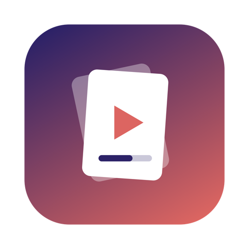
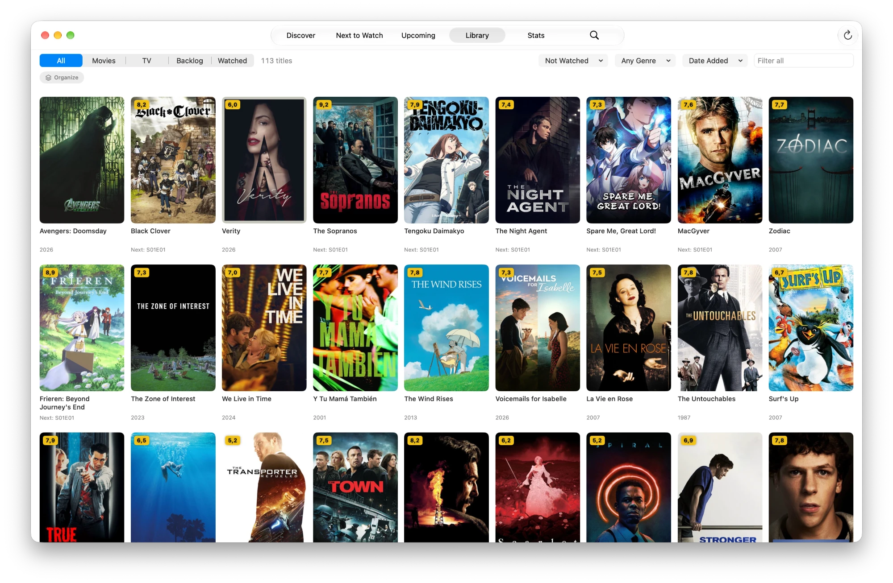

  

<h1 align="center">ToWatchDB</h1>

  Keep track of every movie and TV show you want to watch, are watching, and have watched. 
  For Mac, iPhone, and iPad.

  <a href="https://github.com/msk-mdi/ToWatchDB/releases"><b>Download</b></a>

## What it does

**Find anything.** Search millions of movies and TV shows from [TMDB](https://www.themoviedb.org), or browse
what's trending this week in **Discover**. Every title has its poster, story, cast, trailer, release dates,
and TMDB and IMDb ratings.

**Track what you watch.** Add titles to your library and mark movies, single episodes, whole seasons, or a
whole show as watched. Rate them, mark favorites, write notes, and keep a **Backlog** of what's next.

**Never lose your place.** **Next to Watch** shows the next episode of every show you follow, most recent
first. **Upcoming** lists new episodes and movie releases by date, so you know what's coming this week.

**See where to watch.** Every title lists where it streams, where it's free or on an ad-supported service,
and where to rent or buy it, for your country.

**Organize your way.**
- **Spaces**: your own collections, each with an icon and a color ("Movie Night", "Watch with the kids").
- **Tags**: labels you can put on any title.
- **Smart lists**: saved filters that update themselves, such as "unwatched dramas from the 90s rated 8 or
  more".

Drag posters onto a space or tag to file them.

**Look back.** **Stats** show your watch time, movies, episodes, and shows for a week, a month, a year, or all
time, with your top genres and actors. Compare two years, and share a **Year in Review** card.

**Request on Seerr.** If you run a Seerr, Overseerr, or Jellyseerr server, ask for a movie or a show's seasons
right from its page, see when it's requested, and jump to **Watch Now** when it's on your media server.

**Sync your devices.** Connect Dropbox and every device shows the same library: watch history, backlog,
ratings, notes, and collections. Changes sync on their own a few seconds after each edit.

**Make it yours.** Choose an accent color and a matching app icon. On Mac and iPad, choose a sidebar or a tab
bar along the top.

### On Mac and iPad
- Open any title in its own window.
- Drag posters into your library or backlog, or out to other apps as a link.
- Keyboard shortcuts:

| Shortcut | Action |
|---|---|
| ⌘N | Search |
| ⌘1 to ⌘5 | Next to Watch, Upcoming, Backlog, All Titles, Stats |
| ⌘R | Refresh the library |
| ⇧⌘E | Mark the movie or next episode watched |
| ⇧⌘B | Add to or remove from the backlog |
| ⇧⌘L | Add to or remove from favorites |
| ⇧⌘R | Refresh the title |

### Siri & Shortcuts
Ask "What's next in ToWatchDB", "Mark Severance watched in ToWatchDB", or "Where can I watch Arrival in
ToWatchDB", or build your own shortcuts from 18 actions. Siri only runs actions for apps signed with an Apple
ID: they work when you install on iPhone and iPad with a sideloading tool, but not with the Mac download.

## Download and install

Get the latest version from the [releases page](https://github.com/msk-mdi/ToWatchDB/releases).

### Mac (macOS 15 or later)
1. Download **ToWatchDB.app.zip** and open it.
2. Drag **ToWatchDB** into your **Applications** folder.
3. Open it. The app isn't from the App Store, so the first time macOS says it can't check it. Open
   **System Settings ▸ Privacy & Security**, scroll down, and click **Open Anyway**.

To update, quit ToWatchDB and replace the app in Applications with the new one. Your library is kept.

### iPhone and iPad (iOS and iPadOS 18 or later)
1. Download **ToWatchDB.ipa**.
2. Install it with a sideloading tool such as [AltStore](https://altstore.io) or
   [Sideloadly](https://sideloadly.io), signed in with your free Apple ID.

With a free Apple ID the app has to be renewed every 7 days; these tools do it for you. Your library is kept.

## First launch: connect TMDB

ToWatchDB gets its movie and show information from TMDB, which needs a free key:
1. Create a free account at [themoviedb.org](https://www.themoviedb.org/signup).
2. Go to **Settings ▸ API** on the TMDB website and request an API key (personal use).
3. Copy the **API Read Access Token** (the long one).
4. In ToWatchDB, open **Settings ▸ TMDB** and paste it.

### Optional
- **Dropbox Sync:** **Settings ▸ Dropbox Sync ▸ Connect Dropbox**, on each device, with the same Dropbox account.
  Any Dropbox account works, including a free one: the sync file is small. ToWatchDB can only see its own
  folder, Dropbox ▸ Apps ▸ ToWatchDB, where your library is kept.
- **Seerr:** **Settings ▸ Seerr**: enter your server's address, then sign in with your Jellyfin or Emby account,
  your Seerr account, or the server's API key.
- **Where to Watch country:** **Settings ▸ TMDB** (it starts with your device's region).

## Your data

Your library stays on your device. There's no account and no tracking. The app only goes online to:
- look up titles, posters, and streaming options on TMDB,
- fetch IMDb ratings,
- sync with your own Dropbox, if you connect it,
- talk to your own Seerr server, if you set one up.

Your TMDB token, Dropbox sign-in, and Seerr sign-in are kept in the Keychain on iPhone and iPad, and in a file
encrypted by your Mac's Secure Enclave on Mac.

**Back up** any time from **Settings** (or **File ▸ Export Backup** on Mac). A backup is one file you can
import on any device; importing merges it with what's there, so nothing is lost or doubled. You can also
**Export as CSV** for a spreadsheet, or **Import List of Titles** from a text file with one title per line,
like "Arrival (2016)".

## Questions

**Where are the movie details from?** From TMDB. Streaming availability comes from JustWatch through TMDB, and
ratings from TMDB and IMDb.

**Can I use it without Dropbox?** Yes. Sync is optional; without it, each device keeps its own library.

**Can ToWatchDB read my other Dropbox files?** No. It only has access to its own folder, Dropbox ▸ Apps ▸
ToWatchDB.

**Does it cost anything?** No. ToWatchDB is free, and so is a TMDB key for personal use.

---

  This product uses the TMDB API but is not endorsed or certified by TMDB. Streaming data by JustWatch. 
  Building the app yourself? See the <a href="docs/DEVELOPMENT.md">development guide</a>.

