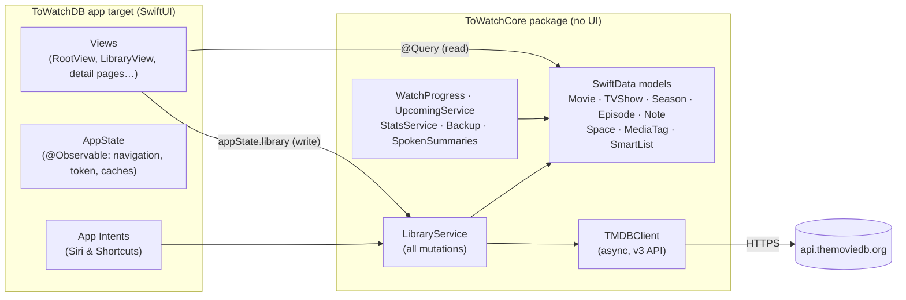
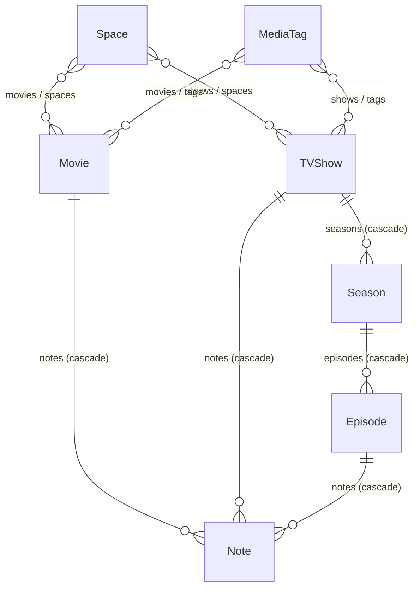

# ToWatchDB codebase guide

ToWatchDB is a movie and TV tracker for macOS, iPadOS and iOS. You search [TMDB](https://www.themoviedb.org),
add titles to a local library, mark movies and episodes as watched, and organize titles into spaces, tags,
and smart lists. The app also offers stats, a Year in Review card, where-to-watch info, backups, and Siri &
Shortcuts actions.

This document explains how the code is organized, how data moves through it, and the rules that keep the UI
fast and stable. Read it before making non-trivial changes. For setup and a feature summary, see the
[README](../README.md).

---

## Contents

1. [The big picture](#1-the-big-picture)
2. [Repository layout](#2-repository-layout)
3. [Building, secrets and signing](#3-building-secrets-and-signing)
4. [Core package: `ToWatchCore`](#4-core-package-towatchcore)
   - [Models](#41-models)
   - [TMDB client](#42-tmdb-client)
   - [LibraryService](#43-libraryservice)
   - [Watch progress and status](#44-watch-progress-and-status)
   - [Upcoming, stats, spoken summaries](#45-upcoming-stats-spoken-summaries)
   - [Backup and CSV](#46-backup-and-csv)
5. [App target: `ToWatchDB`](#5-app-target-towatchdb)
   - [Entry point and scenes](#51-entry-point-and-scenes)
   - [AppState](#52-appstate)
   - [Navigation and layouts](#53-navigation-and-layouts)
   - [PageHost: kept-alive pages on macOS](#54-pagehost-kept-alive-pages-on-macos)
   - [Screens](#55-screens)
   - [Shared components](#56-shared-components)
   - [Appearance: accent color, app icon, layout](#57-appearance-accent-color-app-icon-layout)
   - [Menu commands and the Title menu](#58-menu-commands-and-the-title-menu)
   - [Multiple windows, drag and drop](#59-multiple-windows-drag-and-drop)
   - [Files: backup import/export](#510-files-backup-importexport)
   - [Siri & Shortcuts (App Intents)](#511-siri--shortcuts-app-intents)
6. [Platform differences](#6-platform-differences)
7. [Performance notes](#7-performance-notes)
8. [Rules and gotchas](#8-rules-and-gotchas)
9. [Testing and debugging](#9-testing-and-debugging)
10. [How to…](#10-how-to)
11. [Known limitations](#11-known-limitations)

---

## 1. The big picture



- **Two layers.** All data logic lives in the Swift package `Packages/ToWatchCore`, which has no UI and is
  unit tested. The app target `ToWatchDB/` contains SwiftUI views, app state, and App Intents only.
- **Reads and writes take different paths.** Views read with SwiftData `@Query`. Every write goes through
  `LibraryService`, so rules such as "marking an episode watched takes the show out of the backlog" live in
  one place.
- **Local only.** The store is a SwiftData container on disk with no CloudKit. The models still follow
  CloudKit's rules, so sync can be turned on later without a migration.
- **One multiplatform target.** A single app target builds natively for macOS 15+ and iOS/iPadOS 18+ (not
  Catalyst). Platform-specific behavior uses `#if os(macOS)` / `#if os(iOS)` and the horizontal size class.

---

## 2. Repository layout

```
project.yml                     XcodeGen spec (the .xcodeproj is generated and gitignored)
Config/
  App.xcconfig                  Shared build settings, ad-hoc signing defaults, includes Secrets
  Secrets.example.xcconfig      Template for the gitignored Config/Secrets.xcconfig
Packages/ToWatchCore/
  Package.swift                 macOS 15 / iOS 18, Swift tools 6.0
  Sources/ToWatchCore/
    Models/Models.swift         Movie, TVShow, Season, Episode, Note, PersonCredit, WatchStatus, schema
    Models/Collections.swift    Space, MediaTag, SmartList, SmartListRules
    TMDB/TMDBClient.swift       HTTP client, errors, image URLs
    TMDB/TMDBModels.swift       Codable DTOs for TMDB JSON, date parsing
    TMDB/WatchProviders.swift   Where-to-watch DTOs and endpoints
    Services/LibraryService.swift              Add/refresh/watch/rate/note/delete, TMDB → model mapping
    Services/LibraryService+Collections.swift  Spaces, tags, smart lists
    Services/WatchProgress.swift               Show status, progress, next episode
    Services/UpcomingService.swift             Upcoming releases and episodes
    Services/StatsService.swift                Stats periods, aggregation, activity buckets
    Services/Backup.swift                      JSON backup (export + merge import), CSV export
    Services/SpokenSummaries.swift             Sentences for Siri results
  Tests/ToWatchCoreTests/       Swift Testing suite + recorded TMDB JSON fixtures
ToWatchDB/
  App/                          Entry point, AppState, appearance, debug tools, Keychain token store
  Views/                        All SwiftUI screens and components (see §5.5 and §5.6)
  Intents/                      App Intents: entities, queries, actions, App Shortcuts
  Resources/Assets.xcassets     AppIcon (coral), 9 alternate icons, 10 icon previews, AccentColor
  Info.plist, ToWatchDB.entitlements   Generated from project.yml
Scripts/
  generate-icons.swift          Draws the themed app icons and Settings previews
  snapshot-mac.sh               Debug visual pass: captures each screen's real window on macOS
docs/CODEBASE.md                This file
```

About 9,500 lines of Swift in total.

---

## 3. Building, secrets and signing

| What | Where | Notes |
|---|---|---|
| Project | `project.yml` | Run `xcodegen generate` after adding or removing files. Never edit the `.xcodeproj`. |
| TMDB token | `Config/Secrets.xcconfig` → `TMDB_READ_TOKEN` | Gitignored. Copied into Info.plist as `TMDBReadToken` in Debug only: `Config/Release.xcconfig` clears it, so Release users paste their own. Never commit it. |
| Release builds | `Scripts/build-mac.sh`, `Scripts/install-ios.sh` | Mac: ad-hoc signed `dist/ToWatchDB.app`. iOS: free Apple ID team from Secrets, installed on a connected device. No `get-task-allow` in Release. |
| Token override | Settings ▸ TMDB | Stored in the Keychain by `TokenStore`. It takes priority over the built-in token. |
| Signing | `Config/App.xcconfig` | Ad-hoc by default (`CODE_SIGN_IDENTITY = -`). Set `DEVELOPMENT_TEAM` and `CODE_SIGN_IDENTITY = Apple Development` in Secrets so App Intents run. |
| Entitlements | `project.yml` | macOS sandbox: network client and user-selected file read/write. Not used on iOS (`CODE_SIGN_ENTITLEMENTS[sdk=iphone*]` is empty). |
| Alternate icons | `ASSETCATALOG_COMPILER_ALTERNATE_APPICON_NAMES[sdk=iphone*]` | iOS only. macOS swaps the Dock icon at runtime instead. |
| Custom UTType | `com.mehdi.towatchdb.title` | Exported in Info.plist. Used to drag titles between views and windows. |

Swift 6 with complete strict concurrency. Views and `LibraryService` run on the main actor.

```bash
xcodegen generate
xcodebuild -project ToWatchDB.xcodeproj -scheme ToWatchDB -destination 'platform=macOS' build
xcodebuild -project ToWatchDB.xcodeproj -scheme ToWatchDB -destination 'generic/platform=iOS Simulator' build
cd Packages/ToWatchCore && swift test
```

---

## 4. Core package: `ToWatchCore`

### 4.1 Models

All models are SwiftData `@Model` classes. They follow CloudKit's rules:
- Every stored property is optional or has a default.
- Nothing is `@Attribute(.unique)`.
- Every relationship is optional and has an inverse.

Uniqueness by TMDB ID is therefore enforced in code (`LibraryService.movie(tmdbID:)` / `show(tmdbID:)` are
checked before every insert).



| Model | Key fields | Notes |
|---|---|---|
| `Movie` | `tmdbID`, `title`, `releaseDate`, `runtime`, `genres`, `posterPath`, `trailerKey`, `castData`, `directorsData`; user data: `isWatched`, `watchedDate`, `userRating` (0–10), `isInBacklog`, `isFavorite`, `addedDate` | `watchStatus` is `.watched` or `.notWatched`. `isReleased(asOf:)` |
| `TVShow` | `tmdbID`, `name`, `firstAirDate`, `showStatus`, `networks`, `episodeRuntime`, `castData`, `creatorsData`; user data: `userRating`, `isInBacklog`, `isFavorite`, `isAbandoned` | `sortedSeasons`, `regularEpisodes` (season 0, the specials, excluded), `isOngoing` |
| `Season` | `seasonNumber`, `name`, `airDate`, `episodes` | `sortedEpisodes`, `displayName` |
| `Episode` | `seasonNumber`, `episodeNumber`, `airDate`, `runtime`; user data: `isWatched`, `watchedDate`, `userRating` | `code` ("S01E05"), `hasAired(asOf:)`, `show` |
| `Note` | `text`, `createdAt`, `updatedAt` | Belongs to a movie, a show, or an episode |
| `Space` | `uuid`, `name`, `symbolName`, `colorName` | A curated collection |
| `MediaTag` | `uuid`, `name`, `colorName` | A label. Named this way to avoid clashing with Swift Testing's `Tag` |
| `SmartList` | `uuid`, `name`, `symbolName`, `colorName`, `rulesData` | `rules: SmartListRules`, stored as JSON so new criteria don't need a schema change |

- **Cast and crew** are stored as JSON `Data` (`[PersonCredit]`) rather than as models, because they're only
  displayed.
- **Collections** are referenced by their stable `uuid`, not SwiftData's store-specific IDs. This applies in
  smart-list rules, intents, and navigation.
- **`SmartListRules`:** every set criterion must match (AND), and within a set any value matches (OR). An
  empty set or a `nil` value means "don't filter on this". Criteria: media type, statuses, genres, tag IDs,
  space IDs, minimum rating, release-year range, backlog only, favorites only.
- **`ToWatchSchema.models`** lists every model. The app and the tests build their containers from it.

### 4.2 TMDB client

`TMDBClient` is a `Sendable` struct around `URLSession`, authenticated with a **v4 read token** as a Bearer
header on the **v3 API**. The `language` parameter is sent with every request.

| Method | Endpoint |
|---|---|
| `searchMovies`, `searchTVShows` | `search/movie`, `search/tv` |
| `trendingMovies`, `trendingTVShows` | `trending/{movie,tv}/week` |
| `movie(id:)`, `tvShow(id:)` | `movie/{id}`, `tv/{id}` with `append_to_response=credits,videos` and `include_video_language` |
| `season(showID:seasonNumber:)` | `tv/{id}/season/{n}` |
| `tvShowWithSeasons(id:)` | Detail, then every season concurrently (task group) |
| `watchProviders(movieID:)`, `watchProviders(showID:)` | `…/watch/providers` (JustWatch data, which must be credited) |

- **Dates:** `TMDBDate.parse` reads TMDB's `yyyy-MM-dd` strings as UTC midnights. TMDB dates are calendar
  days, so they're compared against the start of "today" in UTC (`UpcomingService.startOfToday`) and
  formatted in UTC (`Date.tmdbDayString`). The user's own moments (watch dates, added dates) use the local
  calendar.
- **Trailers:** TMDB filters videos by `language`, and most trailers exist only in English, so
  `videoLanguages` asks for the user's language, then English, then language-neutral videos.
  `TMDBVideoList.bestTrailerKey` picks an official YouTube trailer, then any trailer, then a teaser.
- **Images:** `TMDBImage.url(_:size:)` builds image URLs (`TMDBImageSize`: w185, w342, w1280, w300, w92).
  Detail pages use the grid's w342 poster so it's usually already in `ImageCache`.
- **Errors:** `TMDBError` is `.missingToken`, `.http(status:message:)`, or `.decoding`.

### 4.3 LibraryService

`LibraryService` is a `@MainActor struct` holding a `ModelContext` and an optional `TMDBClient`. **Every
mutation goes through it** and ends with `save()`. The app gets one from `appState.library`, and intents get
one from `SharedLibrary.service`.

- **Adding:** `addMovie(tmdbID:)` and `addShow(tmdbID:)` return the existing title if it's already there.
  Otherwise they fetch it and call `insertMovie` / `insertShow`, which re-check for a duplicate after the
  network await.
- **Refreshing:**
  - `refresh(_:)` re-fetches a title. `merge(_:into:)` upserts seasons and episodes by number and never
    touches watch data.
  - `refreshStale(maxAge:)` refreshes ongoing shows and unreleased movies older than 12 hours. It runs at
    launch and from Refresh buttons.
- **Watch state:**
  - `setWatched(movie/episode/season/show, _:on:)` and `markWatchedUpTo(_:)` change watch state.
  - Marking something watched clears the backlog flag. Marking an episode watched also un-abandons its show.
  - Whole seasons and shows only mark episodes that have already aired.
- **Lists, ratings, notes:**
  - `setBacklog`, `setFavorite`, `setAbandoned`
  - `setRating`, clamped to 0–10. The UI shows 5 stars at 2 points each.
  - `addNote`, `update(_:text:)`, `delete(_:)`
- **Collections** (`LibraryService+Collections.swift`):
  - Create, update, and toggle membership for spaces and tags. Smart lists are created and updated the same way.
  - `createTag` reuses an existing tag with the same name, ignoring case.
  - `delete(Space)` and `delete(MediaTag)` also remove the deleted ID from every smart list's rules.
    Otherwise those lists would match nothing.
- **Mapping:** `Movie.apply`, `TVShow.apply`, `Season.apply`, and `Episode.apply` copy TMDB payloads onto
  models.

### 4.4 Watch progress and status

`WatchProgress.swift` defines show-level logic:

| Status | Rule |
|---|---|
| `.abandoned` | `isAbandoned`, which overrides everything else |
| `.watched` | Every **aired** regular episode is watched. A returning show you're caught up on counts as watched. |
| `.watching` | Some episodes watched, but not all aired ones |
| `.notWatched` | Nothing watched |

- `progressSummary(asOf:)` returns a `ShowProgress` (status, fraction, next episode, counts) from **one pass**
  over the episodes. Building `regularEpisodes` touches every season and episode, so screens that need
  several of these values should call it once (the library poster card does).
- `nextEpisodeToWatch` is the first aired, unwatched regular episode. `nextEpisodeToAir` is the first episode
  dated in the future.

### 4.5 Upcoming, stats, spoken summaries

- **`UpcomingService`:** movies and unwatched episodes dated today or later (UTC day), soonest first.
  Abandoned shows are excluded.
- **`StatsService`:**
  - `stats(movies:shows:period:)` returns `WatchStats`: counts, minutes, top genres and actors, a most-watched
    show, the longest movie, activity buckets (day, month, or year depending on the range), poster paths for
    Year in Review, and undated watches.
  - `StatsPeriod` covers all time, a year, this week, this month, and the last N days, on the local calendar.
  - `watchYears` lists the years that have watch history.
- **`SpokenSummaries`:** builds the sentences Siri speaks. They live in the core package so they can be tested.

### 4.6 Backup and CSV

- **Format:** `LibraryBackup` (version 1) is a self-contained JSON snapshot. It includes TMDB metadata, so a
  restore works offline. `BackupCoding.decode` checks the version first, so a backup from a newer app gets a
  clear message.
- **Import is a merge (`importBackup`):**
  - Titles match by TMDB ID.
  - Flags (watched, backlog, favorite, abandoned) are kept if set on either side.
  - Local dates and ratings win; the backup fills in gaps.
  - Notes are deduplicated by text plus creation second.
  - Spaces match by UUID. Tags match by UUID or name. Smart-list rules are remapped to the tags and spaces
    that were kept.
- **Lists of titles (`ListImport.swift`):** `ListImport.parse` reads plain text, one title per line
  ("Arrival (2016) - drama"), with optional MOVIES / TV SHOWS headings. `LibraryService.importList` searches
  TMDB for each (with the year, which matches any release date, then without), picks a result with
  `ListImport.bestMatch` (exact title first, then year; listed years are often regional), downloads 4 at a time,
  and saves once. It can mark titles watched (no date) or backlog, never un-marking. File ▸ Import List of Titles….
- **CSV (`exportCSV(now:timeZone:)`):** one row per title, quoted per RFC 4180. Watch and added dates are
  written as **local** calendar days.

---

## 5. App target: `ToWatchDB`

### 5.1 Entry point and scenes

`App/ToWatchDBApp.swift`:

| Scene | Purpose |
|---|---|
| `WindowGroup(id: "main")` → `RootView` | The main window. On macOS there's one: File ▸ New Window is replaced so ⌘N can mean Search. |
| `WindowGroup("Title", for: TitleReference.self)` → `TitleWindow` | One title in its own window (iPad and Mac) |
| `Settings` → `SettingsView` | macOS only. On iOS, Settings is a sheet opened from a gear button. |

Each scene's root applies `.environment(appState)` and `.themed()` (§5.7). At launch the app enlarges the
shared `URLCache`, runs debug tooling when requested, refreshes stale titles, and updates App Shortcut
parameters whenever it becomes active.

### 5.2 AppState

`App/AppState.swift`. `AppState` is an `@Observable @MainActor` class with one instance per app.

| Member | Role |
|---|---|
| `container` | The SwiftData `ModelContainer`: `SharedLibrary.container` on disk, or in memory for debug sample data |
| `selectedTab: AppTab` | The current page. `AppTab` covers the fixed pages plus `.space/.tag/.smartList(UUID)`. |
| `requestedLibraryScope` | Tab-bar layouts: asks the Library tab's scope picker to switch (for example, ⌘3 → Backlog) |
| `collectionEditor`, `fileRequest` | App-wide requests, handled by whichever window is active (§8) |
| `isShowingSettings` | iOS Settings sheet |
| `mainWindowCount` | Lets menu commands reopen the main window on macOS when it's closed |
| `trending` | Discover's lists, cached for 30 minutes per token and language |
| `language`, `watchRegion` | Persisted in `UserDefaults` |
| `token`, `client`, `library` | The TMDB token (Keychain override, else built-in), a client, and a `LibraryService` |
| `perform(_:)` | Runs a throwing library operation and shows errors in the root alert |
| `refreshLibrary(force:)` | Refreshes stale titles, guarded against running twice |
| `cached(_:_:)` | Memoizes derived data (stats) until the next save. A `ModelContext.didSave` observer bumps a version. Not observed, so it's safe to call from `body`. |

`SharedLibrary` holds the on-disk container and a client factory. App Intents use the same container, so their
changes appear in open windows immediately. `IntentRouter.shared` carries "go to this tab or title" requests
from intents to `RootView`.

### 5.3 Navigation and layouts

`Views/RootView.swift` chooses one of three layouts:

| Layout | When | Structure |
|---|---|---|
| **Sidebar** | Mac or iPad with Settings ▸ Navigation set to Sidebar (the default) | `NavigationSplitView`. The sidebar can't be collapsed: visibility is `.constant(.all)` and the toggle is removed. Every list, space, smart list, and tag has its own row. |
| **Top bar** | Mac or iPad with Top Bar chosen | Mac: a segmented `TopBarPicker` in the toolbar's `.principal` slot, which never shifts. iPad: `TabView` with `.tabBarOnly`. |
| **Compact tabs** | iPhone, or any compact width | `TabView`: Discover, Up Next, Upcoming, Library, and Search (role `.search`) |

- **Tab-bar layouts.** These only have Discover, Next to Watch, Upcoming, Library, Search, and on Mac, Stats.
  If `selectedTab` points anywhere else (from a menu command, Siri, or a layout switch), `RootView.open(_:)`
  redirects:
  - Fixed library scopes go to the Library tab's scope picker, through `requestedLibraryScope`.
  - Collections, Stats on iOS, and Organize open in a sheet.
- **Library tab in tab-bar layouts.** It's a `LibraryView(scope: .all, allowsScopeChange: true)`:
  - It has a segmented scope picker (All, Movies, TV, Backlog, Watched).
  - `CollectionShortcuts` chips (Stats, spaces, smart lists, tags, Organize) sit under the picker.
- **Sidebar rows.** On macOS, `SidebarRow` draws its own selection in the theme color, because AppKit would use
  the system accent. It selects on mouse-down, like a native sidebar. On iPad the list uses native selection,
  and the selected row's icon turns white.
- **Detail destinations.** `appDestinations()` registers them for every stack: `Movie`, `TVShow`,
  `MediaSummary`, `LibraryScope`, `OrganizeRoute`, `StatsRoute`.

### 5.4 PageHost: kept-alive pages on macOS

`Views/Components/PageHost.swift`. Rebuilding a page on every switch (view graph, layout, toolbar) cost
**70–350 ms** of main-thread time on macOS, which showed as a stall. On macOS, `PageHost` keeps the last 8
visited pages alive in a `ZStack` and flips their opacity, the way a native tab view does. It cut revisits to
about 30–110 ms.

Only the root of each page is kept: a page that's hidden is popped back to its root. Every stack with a
pushed detail adds a Back button to the window's single toolbar, and AppKit crashes on a second one
(`NSToolbar already contains an item with the identifier com.apple.SwiftUI.navigationStack.back`).

A hidden page is still in the view tree, so it must not contribute window chrome. Each page reads
`@Environment(\.isActivePage)` and uses:

| Instead of | Use | Why |
|---|---|---|
| `.navigationTitle(_)` | `.pageTitle(_)` | The title sits on an empty background view that only the visible page has. An empty title from a hidden page still won. |
| `.toolbar { … }` | `.pageToolbar { … }` | Toolbar items appear only on the visible page |
| `.navigationSubtitle` | `.navigationSubtitleIfAvailable` | Same pattern as titles |
| `.searchable` | `PageSearch` (Search page) or a plain field in the toolbar (Library) | A hidden page's search field can't be switched off otherwise |
| `.focusedSceneValue(\.focusedTitle, x)` | `isActivePage ? x : nil` | Keeps the Title menu acting on the visible title |

iOS keeps the simpler `NavigationStack { … }.id(selectedTab)`.

### 5.5 Screens

| File | Screen |
|---|---|
| `Discover/DiscoverView.swift` | Trending movies and shows in horizontal shelves, served from `appState.trending`. Has a Refresh button. |
| `Discover/SearchView.swift` | Searches TMDB (300 ms debounce) with a Movies/TV picker. The field gets focus when the page opens. |
| `Discover/RemotePosterCard.swift` | A result card with a quick "+" add button, plus `PosterGrid` (an adaptive `LazyVGrid`) |
| `Discover/MediaSummary.swift` | `MediaSummary`, a TMDB result that may not be in the library yet, and `LibraryIDs` |
| `Library/LibraryView.swift` | Poster grid for a `LibraryScope`, with status and genre filters, sort (Genre groups the grid into a section per main genre), text filter, drop target, and empty states. Also defines `LibraryPosterCard`, with status badge, progress bar, and context menu. |
| `Library/LibraryItem.swift` | `LibraryItem` (a movie or a show), `LibraryScope`, and `LibrarySort` (sorting with title tie-breaks) |
| `Library/NextToWatchView.swift` | The next aired episode of every show you're following, most recently watched first. Swipe or click to mark it watched. |
| `Library/UpcomingView.swift` | Upcoming items grouped by day, with Today / Tomorrow / In N days labels |
| `Detail/DetailLayout.swift` | Shared detail page (backdrop, poster, title, actions, overview, facts, extra content, cast). Also defines `ActionBar`, `CastRow`, `ExternalLinks`, and the label styles. |
| `Detail/MovieDetailView.swift` | Movie page: watched (with date), backlog, favorite, rating, links, where to watch, collections, and notes |
| `Detail/TVShowDetailView.swift` | Show page: progress, "Mark SxxExx Watched" (marks the next episode), season picker, episode rows with context menus, and episode notes and rating |
| `Detail/RemoteDetailView.swift` | A TMDB title: shows the library page if the title is in the library, otherwise a preview with Add buttons |
| `Detail/WhereToWatchSection.swift` | Providers by country (stream, free, ads, rent, buy), with a country picker and JustWatch credit |
| `Detail/NotesSection.swift` | Inline notes (add, edit, delete) and `WatchDateSheet` |
| `Collections/CollectionViews.swift` | Context-menu submenus (`CollectionMenus`), the detail page's Spaces & Tags section, `FlowLayout`, `CollectionShortcuts`, and `OrganizeView` |
| `Collections/CollectionEditors.swift` | Space, tag, and smart-list editor sheets, presented by `CollectionEditorPresenter` |
| `Collections/CollectionStyle.swift` | `CollectionPalette` (named colors, symbols), swatch and symbol pickers, `CollectionChip` |
| `Stats/StatsView.swift` | Period menu, summary tiles, activity chart (Swift Charts), top genres and actors, highlights, year comparison |
| `Stats/YearInReview.swift` | A 4:5 share card rendered with `ImageRenderer` (posters downloaded first) |
| `Settings/SettingsView.swift` | Appearance (layout, accent color, app icon), TMDB token, language and region, library refresh, backup, about |
| `Transfer/LibraryTransfer.swift` | `LibraryFileRequest` and the save/open panels (§5.10) |
| `Transfer/ListImportSheet.swift` | Importing a list of titles: counts, "add as" choice, progress, and titles not found |

### 5.6 Shared components

| File | What |
|---|---|
| `Components/RemoteImage.swift` | `ImageCache`, an in-memory `NSCache` of decoded `CGImage`s (256 MB). Decoding happens off the main thread. `RemoteImage` draws cached images on the first frame and fades in only fresh downloads. **Use it instead of `AsyncImage`.** |
| `Components/PosterImage.swift` | `PosterImage`, a 2:3 poster with a placeholder, and `BackdropImage` |
| `Components/EmptyState.swift` | `.centeredEmptyState(isShown) { … }`. Every empty message is centered on the page, even over a scroll view with a header. |
| `Components/PageHost.swift` | See §5.4 |
| `Components/TitleReference.swift` | `TitleReference`, a `Transferable` title pointer. Also `titleInteractions` (drag, and lift on hover), `OpenInNewWindowButton`, and `TitleWindow`. |
| `Components/StatusBadge.swift` | Status glyphs, `Chip`, and formatting helpers (`yearString`, `tmdbDayString`, `runtimeString`) |
| `Components/RatingView.swift` | Five-star control with accessibility actions |

### 5.7 Appearance: accent color, app icon, layout

`App/Appearance.swift`:

- **`NavigationLayout`** (`.sidebar` or `.topBar`), stored in `@AppStorage("navigationLayout")`. Only Mac and
  iPad offer the choice.
- **`ThemeColor`:** coral (the default, from the `AccentColor` asset), orange, yellow, green, teal, blue,
  indigo, purple, pink, and graphite. The same enum is used for the accent and for the app icon. They're
  stored separately, as `accentColor` and `appIcon`.
- **`.themed()`** applies `.tint(color)` and sets `\.themeColor` for places that need a `Color` rather than
  the tint style: charts, gradients, chips. Use `.tint` or `themeColor` in views. **Don't use
  `Color.accentColor`.**
- **`applyAsAppIcon()`:**
  - iOS: `setAlternateIconName("AppIcon-<Name>")`. The system shows its own confirmation.
  - macOS: `NSApp.applicationIconImage` from `IconPreview-<Name>`. It only lasts while the app runs, because
    the bundle's icon is signed.
- **Icon assets** are generated by `Scripts/generate-icons.swift`:
  - 10 `IconPreview-*` image sets (macOS shape, 512 px)
  - 9 `AppIcon-*` alternate sets (opaque, full bleed, 1024 px)
  - The primary `AppIcon` is coral and was drawn the same way.

### 5.8 Menu commands and the Title menu

`AppCommands` in `ToWatchDBApp.swift`:

- **File:**
  - Search TMDB (⌘N)
  - New Space, New Smart List, New Tag
  - Import Backup (⇧⌘I), Export Backup (⇧⌘S), Export as CSV
  - On macOS this group replaces New Window.
- **Window:** Library Window (⌘0), which reopens the main window when it's closed.
- **Library:** Refresh (⌘R), and lists on ⌘1–⌘5 (Next to Watch, Upcoming, Backlog, All, Stats).
- **Title:** acts on `@FocusedValue(\.focusedTitle)`, set by the visible movie or show page.
  - Mark Watched or the next episode (⇧⌘E)
  - Backlog (⇧⌘B), Favorite (⇧⌘L), Refresh Title (⇧⌘R)
  - Abandon (shows only)

If the main window is closed, commands call `openWindow(id: "main")` first (`inMainWindow`).

### 5.9 Multiple windows, drag and drop

- **Windows:** "Open in New Window" (context menus) opens `TitleWindow` through `openWindow(value: TitleReference)`.
- **Dragging:** posters are `.draggable(TitleReference)`. Inside the app they carry the custom type. Other
  apps receive a TMDB URL, through a `ProxyRepresentation`.
- **Dropping:** `LibraryView` is a `.dropDestination`.
  - Dropping onto any list adds the title to the library.
  - Dropping onto Backlog also flags it for the backlog.
  - Dropping onto a space or tag also files it there.
  - Watched and smart lists refuse drops, since their contents come from rules.

### 5.10 Files: backup import/export

`libraryFileTransfers(_:)` turns a `LibraryFileRequest` into `.fileExporter` / `.fileImporter` panels.
Several windows carry it: the main window, title windows, and the macOS Settings window. Only the active
window claims a request (§8). Imported files are opened with security-scoped access. Export file names use
the local date.

### 5.11 Siri & Shortcuts (App Intents)

`Intents/Entities.swift`:
- **Entities:** `MovieEntity` and `ShowEntity` (ID is the TMDB ID, with string search over the library) and
  `CollectionEntity` (a space, smart list, or tag).
- **Enums:** `AppList` and `StatsPeriodOption`.

`Intents/Intents.swift` defines 18 actions:

| Group | Actions |
|---|---|
| Asking | Get Next Episodes, Get Upcoming, Get Watch Stats, Where to Watch (movie or show) |
| Changing | Mark Next Episode Watched, Mark Movie Watched (refuses unreleased movies), Rate Movie or Show, Move Movie or Show to Backlog, Add Note to Movie or Show |
| Opening | Open List, Open Space/Smart List/Tag, Open Movie, Open TV Show, Search |

- **Siri phrases:** `ToWatchShortcuts` has 9 App Shortcuts, for example "What's next in ToWatchDB" and "Mark
  ⟨show⟩ watched in ToWatchDB". `updateAppShortcutParameters()` runs when the app becomes active, so Siri
  learns your current show and movie names.
- **Opening actions** set `IntentRouter.shared`, and `RootView` navigates.
- **Signing:** the system only runs intents from apps signed with a team (§3).

---

## 6. Platform differences

| Area | macOS | iPadOS | iOS (iPhone) |
|---|---|---|---|
| Layout | Sidebar or top bar | Sidebar or top bar | Compact tabs |
| Page switching | `PageHost` (kept alive) | Rebuilt (`.id`) | `TabView` |
| Sidebar selection | Custom, theme-colored, selects on mouse-down | Native, icon turns white | n/a |
| Settings | `Settings` scene (⌘,) | Sheet from the gear | Sheet from the gear |
| Library filters | Toolbar (sidebar layout) or page header (top bar) | Filter & Sort menu, `.searchable` | Same as iPad |
| Detail actions | One row | One row | Full-width primary button, equal-width toggles, rating on its own line |
| App icon | Dock icon while running | Alternate icon | Alternate icon |
| Hover | Poster scales up 3% | `.hoverEffect(.lift)` | n/a |
| Stats | Sidebar entry or top-bar tab | Sidebar entry or Library chip | Library chip |

---

## 7. Performance notes

These choices were made after profiling with Instruments (Time Profiler, macOS):

1. **Use `RemoteImage`, not `AsyncImage`.** `AsyncImage` keeps nothing between appearances, so every page
   switch re-showed placeholders and decoded every poster again on the main thread.
2. **Don't put `@Query` in per-item views.** On macOS, SwiftUI builds every poster's context menu up front.
   A query inside `CollectionMenus` ran two database fetches per poster. The grid now fetches spaces and tags
   once and passes them down.
3. **Walk a show's episodes once.** Use `progressSummary()` instead of separate `watchStatus()`,
   `progress()`, and `nextEpisodeToWatch()` calls. Sort by precomputed keys (`LibrarySort.sorted`) instead of
   recomputing inside comparators.
4. **Cache derived data with `appState.cached(key) { … }`.** Stats are recomputed only after a save, and the
   year comparison reuses the page's stats.
5. **Keep pages alive on macOS** (`PageHost`). What remains on a switch is mostly AppKit relaying out the
   toolbar.
6. **Discover's trending lists** are cached in `AppState` for 30 minutes.
7. **Don't sort to walk episodes.** `regularEpisodes` sorts every season and episode; use
   `forEachRegularEpisode` (unsorted) or `progressSummary()`, which also returns `lastWatched`.
8. **Share per-show progress.** `appState.progress(of: shows)` computes every show's `ShowProgress` once per
   save; the library grids and Next to Watch read it instead of walking episodes themselves.
9. **Hidden pages don't recompute.** Kept-alive pages pass `allowStale: !isActivePage` to `appState.cached`, so a
   save doesn't recompute stats, Upcoming, or grids nobody can see. Values from before a deletion are never
   served stale (they could hold deleted models). `libraryVersion` is observed, so cached pages redraw after saves.
10. **Refresh in parallel, save once.** `refreshStale` fetches 4 titles at a time and saves at the end; every
    save redraws each open page. `apply` only writes episode and season fields that changed.
11. **One download per image.** `ImageCache` shares in-flight downloads between views showing the same URL.
12. **Detail responses are cached for an hour** (`appState.cachedResponse`): Where to Watch and TMDB previews.

To measure page switches, see §9.

---

## 8. Rules and gotchas

- **Every macOS page must have at least one toolbar item.** With an empty toolbar, macOS collapses it and the
  whole window (traffic lights, sidebar, title) jumps when you switch to that page. This is why Upcoming,
  Discover, and Organize have Refresh or Add buttons, and why Library's filters are toolbar items in the
  sidebar layout.
- **Inside pages hosted by `PageHost`, use `pageTitle` / `pageToolbar`** (§5.4). A raw `.toolbar` or
  `.navigationTitle` on a page shows up even while the page is hidden.
- **App-wide requests are claimed by one window.**
  - `appState.collectionEditor` and `appState.fileRequest` are global.
  - `CollectionEditorPresenter` and `LibraryFileTransfers` present them only in the active window
    (`appearsActive` on macOS), or in the first window that sees them on iPad.
  - They read the binding rather than the `onChange` value, so a second window sees the request is already taken.
- **TMDB dates are UTC days; user dates are local.** Don't format a release date with the local time zone, or
  it can show a day early. Don't write a watch date as a UTC day.
- **All writes go through `LibraryService`.** Writing to models directly skips the save and the side-effect
  rules.
- **Never use `Color.accentColor` in views.** Use `.tint` or `\.themeColor`, so the user's color applies.
- **Empty states use `.centeredEmptyState`.** A message inside a `ScrollView` would sit at the top.
- **Main-thread SwiftData.** `LibraryService` and the container's `mainContext` are `@MainActor`. Intents
  share the same container.
- **`TitleReference` must stay `Codable` and stable.** Restored windows decode it.
- **Secrets.** `Config/Secrets.xcconfig` is gitignored. The token is compiled into the built app's
  Info.plist only.

---

## 9. Testing and debugging

### Unit tests

There are 27 tests in `Packages/ToWatchCore/Tests/ToWatchCoreTests/ToWatchCoreTests.swift`, written with
Swift Testing. They cover:
- decoding the recorded fixtures
- date parsing
- watch status and next-episode logic
- upcoming, adding without duplicates, and marking seasons watched
- ratings and notes
- smart-list rules
- stats periods and ranking
- the backup round trip and merge import, and CSV quoting and local dates
- spoken summaries
- the trailer language fallback
- cleaning up rules when a space or tag is deleted

```bash
cd Packages/ToWatchCore && swift test
```

Tests keep their `ModelContainer`s alive (`liveContainers`). A context doesn't retain its container.

### Debug launch arguments (Debug builds only, `App/DebugTools.swift`)

| Argument | Effect |
|---|---|
| `-UISeedSampleData YES` | Uses a throwaway in-memory library seeded from TMDB with Severance, Inception, Game of Thrones, Dune, an unreleased movie, a space, a tag, and a smart list |
| `-UISkipSeed YES` | With the above: keeps the library empty, to check empty states |
| `-UISnapshotDir <dir>` | macOS: seeds, visits every page, writes `<page>.png` plus a `.wid` window number per page, then quits |
| `-UISnapshotSwitchOnly YES` | With `-UISnapshotDir`: only switches pages (with signposts), for profiling |
| `-navigationLayout sidebar\|topBar`, `-accentColor <name>`, `-appIcon <name>` | Override the `@AppStorage` settings for one run |

### Scripts

- **`Scripts/snapshot-mac.sh [args]`:** runs the snapshot mode and captures each page's real window with
  `screencapture -l` into `~/Library/Containers/com.mehdi.towatchdb/Data/tmp/snap/*-window.png`. It needs
  Screen Recording permission for the terminal. Only the app's own window is captured.
- **Profiling page switches:**

  ```bash
  xcrun xctrace record --template "Time Profiler" --output sw.trace --time-limit 60s --launch -- \
    build/DerivedData/Build/Products/Debug/ToWatchDB.app/Contents/MacOS/ToWatchDB \
    -UISnapshotDir ~/Library/Containers/com.mehdi.towatchdb/Data/tmp/snap -UISnapshotSwitchOnly YES
  ```

  The "Switch" signposts (Points of Interest) mark each page change.
- **iOS Simulator:**

  ```bash
  xcrun simctl launch <device> com.mehdi.towatchdb -UISeedSampleData YES
  ```

---

## 10. How to…

**Add a page to the sidebar.**
1. Add a case to `AppTab`.
2. Add a `SidebarRow` in `RootView.sidebarRows`.
3. Add a branch in `RootView.screen(for:)`.
4. In the page, use `.pageTitle` and `.pageToolbar` with at least one toolbar item, and
   `.centeredEmptyState` for its empty state.
5. If it isn't a tab in tab-bar layouts, decide how `RootView.open(_:)` reaches it (sheet or Library scope).

**Add a field to a model.**
1. Give it a default or make it optional (CloudKit rules).
2. Map it in the `apply(_:)` extensions if it comes from TMDB.
3. Add it to the backup records (`Backup.swift`): `record(_:)`, `makeMovie` / `makeShow`, and the merge rules.
   Keep old backups decodable: make new record fields optional, or bump `LibraryBackup.currentVersion` and
   handle older versions.
4. Add a test.

**Add a smart-list criterion.** Add an optional or defaulted property to `SmartListRules`, check it in
`matchesCommon`, and add a control in `SmartListEditor`. Existing lists keep working because the rules are
JSON with defaults.

**Add a Siri action.**
1. Add an `AppIntent` in `Intents.swift`. Use `SharedLibrary.service` for writes, `IntentRouter` for
   navigation, and `SpokenSummaries` for any sentence worth testing.
2. Optionally add an `AppShortcut` with phrases that include `\(.applicationName)`.

**Add a theme color.**
1. Add a case to `ThemeColor` and a `Theme` in `Scripts/generate-icons.swift`.
2. Run `swift Scripts/generate-icons.swift ToWatchDB/Resources/Assets.xcassets`.
3. Add `AppIcon-<Name>` to `ASSETCATALOG_COMPILER_ALTERNATE_APPICON_NAMES` in `project.yml`.

**Show a TMDB image.** Use `PosterImage` or `RemoteImage(url: TMDBImage.url(path, size:))`, never `AsyncImage`.

---

## 11. Known limitations

- **No sync.** The library is local to each device. Use backup export and import to move it. The models are
  ready for CloudKit if that changes.
- **Siri & Shortcuts need a signed build.** The system ignores intents from ad-hoc signed apps (§3).
- **macOS app icon changes are temporary.** They only affect the Dock while the app runs. Finder keeps the
  coral icon.
- **First visits still rebuild.** The first visit to a page after launch on macOS pays the full build cost.
  Only revisits are fast (§5.4).
- **Widgets aren't implemented.** They were dropped from the scope.
- **TMDB terms.** The app must keep the attribution "This product uses the TMDB API but is not endorsed or
  certified by TMDB" and credit JustWatch for streaming data.
